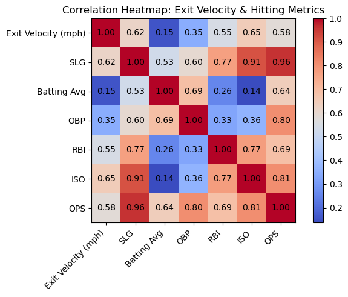
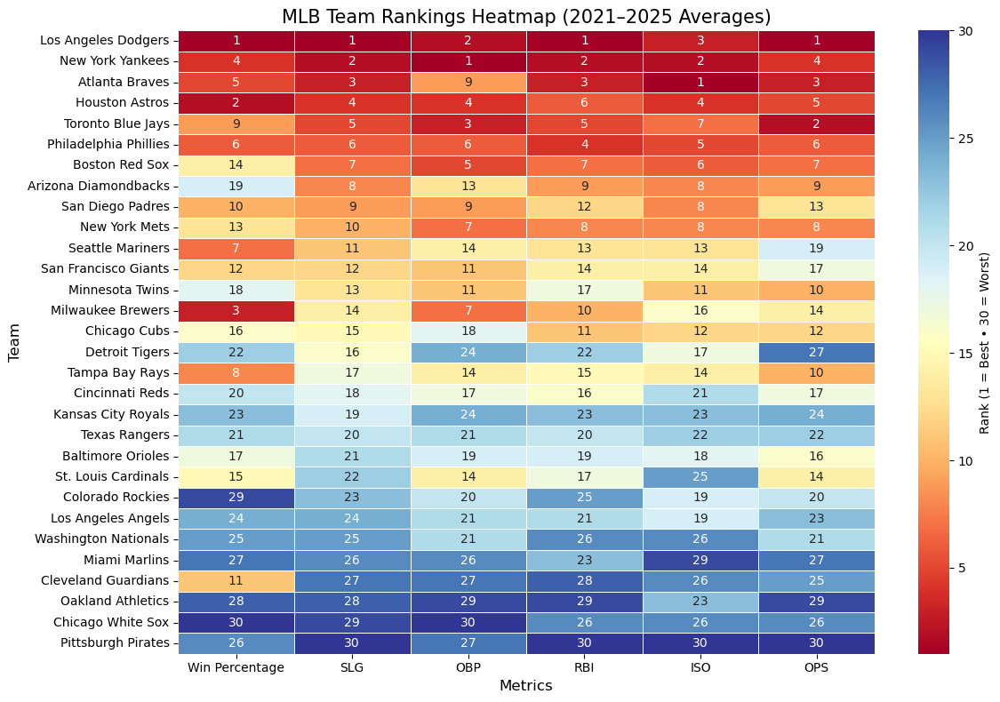

# MLB Offensive Performance Analysis (2021–2028)

## Executive Summary

This report analyzes MLB offensive performance indicators from 2021–2025 and projects team and player level trends through 2028. Using data from **Baseball Savant**, we identified key metrics — OPS, ISO, OBP, SLG, and exit velocity — that strongly influence offensive success. The report targets new MLB managers entering the field.

Data-driven insights help prioritize acquisitions, lineup decisions, and development focus for immediate and long-term impact.

- **Players:** Top performers show consistent OPS and ISO trends; exit velocity correlates moderately with power metrics. Projections highlight potential breakout players and those likely to sustain high performance.

- **Teams:** Linear regression projections of Win%, SLG, OBP, RBI, ISO, and OPS suggest which teams may improve or decline over the next three seasons, helping anticipate competitive dynamics.

**Recommendations:**

- Focus on players with consistently high OPS and ISO to strengthen your lineup.

- Monitor emerging talents who show upward trends in exit velocity and isolated power.

- At the team level, invest in strategies that improve OBP and SLG to maximize run production.

---

## 1. Introduction

Our team analyzes **MLB batting performance indicators** using data from Baseball Savant covering the period from 2021–2025. This analysis focuses on metrics that are predictive of team and player success, such as: EV, OPS, ISO, OBP, and SLG.

**Decision-maker:**

- This report is designed for a young MLB manager entering the field, who needs actionable insights to make decisions on lineups, player acquisitions, and offensive strategy.

**Research Question:**

- Which batting metrics and team-level KPIs are most predictive of future offensive performance, and how can these insights guide managerial decisions for the next three seasons (2026–2028)?

**Impact:**

- By understanding trends and projections, the new MLB manager can identify key performers, prioritize acquisitions, optimize lineups, and plan for sustainable team success.

---

## 2. Data Summary

**Primary Datasets:**

- MLB team stats 2021-2025.csv

- MLB player stats 2021-2025.csv

**Data characteristics:**

- Mixed continuous metrics, percentages, and categorical identifiers (player name, year, team).
- Source: Baseball Savant official website (https://baseballsavant.mlb.com/)

**Data Metrics Glossary:**

&nbsp;&nbsp;**1) Player-level Metrics**

| Abbreviation         | Full Name / Description                                                                 |
|:---------------------|:----------------------------------------------------------------------------------------|
| last_name            | Player’s last name                                                                     |
| first_name           | Player’s first name                                                                    |
| player_id            | MLB’s unique ID for the player, used for data merging                                   |
| year                 | Season year the stats come from                                                         |
| player_age           | Player’s age during that season                                                         |
| pa                   | Plate appearances                                                                       |
| hit                  | Total hits recorded                                                                     |
| k_percent            | Percentage of plate appearances that end in a strikeout                                 |
| bb_percent           | Percentage of plate appearances that end in a walk                                      |
| batting_avg          | Batting average: how often the player gets a hit per at-bat                              |
| slg_percent          | Slugging percentage: measures hitting power by counting total bases per at-bat          |
| on_base_percent      | How often the player reaches base by any method (hit, walk, hit-by-pitch)             |
| on_base_plus_slg     | OPS: combined measure of getting on base (OBP) and hitting for power (SLG)            |
| isolated_power       | ISO: measures pure power by counting only extra-base hits                               |
| babip                | Batting average on balls in play: how often a ball put in play becomes a hit (excl. HR & strikeouts) |
| b_rbi                | Expected/adjusted RBI metric based on quality of contact                                 |
| xba                  | Expected batting average based on batted-ball quality                                   |
| xslg                 | Expected slugging percentage based on batted-ball quality                               |
| woba                 | Weighted on-base average: advanced metric measuring total offensive value using run-values for each event |
| xwoba                | Expected wOBA based on contact quality                                                 |
| xobp                 | Expected on-base percentage                                                             |
| xiso                 | Expected ISO (expected power output)                                                   |
| wobacon              | wOBA on contact only (ignores strikeouts and walks)                                     |
| xwobacon             | Expected wOBA on contact based on batted-ball data                                      |
| exit_velocity_avg    | Average exit velocity (mph) of all balls the player hits 

&nbsp;&nbsp;**2) Team-level Metrics**

| Abbreviation | Full Name / Description                                     |
|:-------------|:--------------------------------------------------------------|
| Win%        | Team winning percentage over the season                     |
| SLG         | Slugging percentage: measures hitting power by total bases  |
| OBP         | On-base percentage: how often the team reaches base        |
| RBI         | Runs batted in: total runs produced by the team             |
| ISO         | Isolated power: extra-base hitting ability                  |
| OPS         | On-base plus slugging: combined measure of offensive value |

**Data Overview:**

- Top performers in 2025 show consistent OPS and ISO trends.

- Exit velocity correlates moderately with slugging metrics.

- Team-level projections show potential growth in offensive output for certain teams (expected Win% increase for top 10 teams).

**Summary statistics:**

- Based on the full dataset of all players / teams and used 5th–95th percentile trimmed data to avoid extreme outliers and produce realistic projections.

&nbsp;&nbsp;**1) Player-level stats**: Calculated for the main KPIs (Exit Velocity, SLG, Batting Average, OBP, RBI, ISO, and OPS).

-  **Historical stats 2021 – 2025** 

| Statistic | Exit Velocity (mph) | SLG | Batting Average | OBP | RBI | ISO | OPS |
|:-----------|:-------------------:|:-----:|:----------------:|:-----:|:-----:|:-----:|:-----:|
| Mean      | 89.70             | 0.44| 0.26           | 0.33| 74.76| 0.18| 0.77|
| Median    | 89.70             | 0.44| 0.26           | 0.33| 73.00| 0.18| 0.77|
| StdDev    | 2.16              | 0.06| 0.03           | 0.03| 19.63| 0.05| 0.08|
| Variance  | 4.65              | 0.00| 0.00           | 0.00| 385.49|0.00| 0.01|
| Min       | 82.30             | 0.27| 0.18           | 0.24| 23.00| 0.05| 0.56|
| Max       | 96.20             | 0.70| 0.35           | 0.46| 144.00|0.38| 1.16|
| Range     | 13.90             | 0.43| 0.17           | 0.23| 121.00|0.33| 0.60|

- **Projected stats 2026 – 2028**

| Statistic | Exit Velocity (mph) | SLG | Batting Average | OBP | RBI | ISO | OPS |
|:-----------|:-------------------:|:-----:|:----------------:|:-----:|:-----:|:-----:|:-----:|
| Mean      | 89.37             | 0.41| 0.25           | 0.32| 67.74| 0.16| 0.73|
| Median    | 89.32             | 0.41| 0.25           | 0.32| 65.80| 0.16| 0.73|
| StdDev    | 2.42              | 0.08| 0.03           | 0.04| 22.65| 0.06| 0.10|
| Variance  | 5.84              | 0.01| 0.00           | 0.00| 513.13|0.00| 0.01|
| Min       | 84.14             | 0.20| 0.17           | 0.21| 16.86| 0.02| 0.43|
| Max       | 94.87             | 0.57| 0.32           | 0.40| 123.62|0.30| 0.96|
| Range     | 10.73             | 0.37| 0.15           | 0.19| 106.76|0.28| 0.53|

&nbsp;&nbsp;**2) Team-level stats**: Calculated for the main KPIs (Win%, SLG, OBP, RBI, ISO, OPS).

-  **Historical stats 2021 – 2025**

| Statistic | Win Percentage | SLG | OBP | RBI | ISO | OPS |
|:---|:---:|:---:|:---:|:---:|:---:|:---:|
| Mean | 0.50 | 0.40 | 0.32 | 686.65 | 0.15 | 0.72 |
| Median | 0.50 | 0.39 | 0.32 | 683.00 | 0.15 | 0.72 |
| StdDev | 0.05 | 0.02 | 0.01 | 32.90 | 0.01 | 0.02 |
| Variance | 0.00 | 0.00 | 0.00 | 1082.32 | 0.00 | 0.00 |
| Min | 0.42 | 0.37 | 0.30 | 630.00 | 0.14 | 0.69 |
| Max | 0.57 | 0.44 | 0.33 | 746.00 | 0.19 | 0.76 |
| Range | 0.16 | 0.06 | 0.03 | 116.00 | 0.05 | 0.07 |

- **Projected stats 2026 – 2028**

|Statistic | Win Percentage | SLG | OBP | RBI | ISO | OPS |
|:---|:---:|:---:|:---:|:---:|:---:|:---:|
| Mean | 0.50 | 0.40 | 0.32 | 686.91 | 0.15 | 0.72 |
| Median | 0.50 | 0.39 | 0.32 | 682.99 | 0.15 | 0.72 |
| StdDev | 0.05 | 0.02 | 0.01 | 34.74 | 0.01 | 0.02 |
| Variance | 0.00 | 0.00 | 0.00 | 1206.55 | 0.00 | 0.00 |
| Min | 0.39 | 0.37 | 0.30 | 626.25 | 0.13 | 0.68 |
| Max | 0.58 | 0.44 | 0.33 | 771.31 | 0.19 | 0.77 |
| Range | 0.19 | 0.07 | 0.03 | 145.07 | 0.06 | 0.09 |

---

## 3. Data Analytics

### 3.1 Team Projections (2026–2028)

These plots show projected team-level KPIs for the next three seasons of top 10 teams based on linear regression with correlated predictors.  

**Top Teams Selected:** Based on 2025 Win%

**Graphs and Captions:**

**Projected Win Percentage (2026–2028)**  
  
*Description:* Projected win percentage for top MLB teams. Shows expected growth/decline in team performance over three years.

**Projected SLG (2026–2028)**  
  
*Description:* Shows projected slugging performance of top teams. Patterns indicate which teams may improve power hitting.

**Projected OBP (2026–2028)**  
  
*Description:* Team on-base percentage projection, reflecting plate discipline and consistency.

**Projected RBI (2026–2028)**  
  
*Description:* Estimated run production by team, linked to scoring potential.

**Projected ISO (2026–2028)**  
  
*Description:* Measures team isolated power; highlights teams likely to hit extra-base hits.

**Projected OPS (2026–2028)**  
  
*Description:* Combined on-base plus slugging metric, giving a broad measure of offensive efficiency.

---

### 3.2 Player Projections (2026–2028)

These plots show projected player-level KPIs for the top 10 players based on prior performance and correlated metrics.

**Graphs and Captions:**

**Projected SLG for Top Players**  
  
*Description:* Expected slugging trends for top players. Highlights consistency and potential breakout performers.

**Projected OPS for Top Players**  
  
*Description:* Combines OBP and SLG for a holistic view of player offensive output.

**Projected ISO for Top Players**  
  
*Description:* Player isolated power trends, indicating extra-base hitting capability.

**Projected Batting Average for Top Players**  
  
*Description:* Tracks expected hit rate per at-bat for top players.

**Projected OBP for Top Players**  
  
*Description:* Player on-base percentage projections, reflecting consistency and plate discipline.

**Projected RBI for Top Players**  
  
*Description:* Expected run production per player, linked to scoring potential.

**Projected Exit Velocity for Top Players**  
_2026_2028.png)  
*Description:* Exit velocity trend predictions; higher values often correlate with power hitting.

### 3.3 Scatter Plots & Heatmaps (Quick Reference)

These plots show relationships between exit velocity and player hitting stats, and overall correlations among KPIs.

**EV vs SLG:**  
  

**EV vs RBI:**  
  

**EV vs OPS:**  
  

**EV vs OBP:**  
  

**EV vs ISO:**  
  

**Players Metrics Heatmap**  
{width=600px}

**Team Rankings Heatmap (2021–2025 averages):**  
{width=900px}

## 4. Conclusion

Our analysis combined historical MLB player and team level statistics with regression-based projections to estimate future offensive performance for 2026–2028. By examining KPIs such as SLG, OBP, OPS, ISO, RBI, Batting Average, and Exit Velocity, we generated insights into which metrics are most indicative of future success.

**Key Findings:**

- OPS and ISO consistently emerge as the strongest indicators of future offensive performance at both the team and player levels. Teams and players maintaining strong OPS trends also show positive projections in Win%, RBI, and SLG.

- Exit Velocity has moderate correlation with power metrics (ISO ≈ 0.65, SLG ≈ 0.62), but does not strongly correlate with most KPIs. This means EV is useful, but not a primary predictor in our dataset.

**Team Projections (2026–2028):**

- Projected Win%, SLG, OBP, ISO, and OPS show identifiable upward/downward trends, helping estimate which teams may strengthen or decline offensively.

**Player Projections (2026–2028):**

- Top hitters show differentiated paths in SLG, OPS, ISO, AVG, OBP, and Exit Velocity, helping identify consistent elite hitters versus potential breakout performers.

**Heatmaps and Scatter Plots:**

- Visualizations confirm metric relationships and validate the linear regression models used for projections.
Scatter plots visually confirm the moderate relationships between EV and power statistics.

**Limitations:**

- The model only uses batting statistics; defensive and situational factors are not included.

- Projections are based on linear regression, which may not capture sudden changes (injuries, role changes, coaching changes, etc.).

- Extreme outliers were trimmed (5th–95th percentile) to stabilize results.

**Future Work:**

- Add park effects, defensive WAR, sprint speed, pitch-level statcast features, injury history, and multivariate models.

- Use machine learning methods for improved forecasting accuracy.

## 5. Policy Recommendation

**Hypothetical Decision:**

- Prioritize player acquisitions, lineup optimization, trade evaluation, and contract negotiations based on projected offensive outputs.

**Data-driven Recommendation:**

- Focus on players and teams with consistently high OPS, ISO, and OBP. Consider potential breakout performers in mid-tier metrics.

**Benefits:**

- Quantitative and objective evaluation of offensive potential.

**Risks:**

- The recommendations ignore defensive and baserunning contributions and external variables such as player health or mid-season trades. Continuous monitoring and model updates are essential.

---

## Team Collaboration Notes

**Challenges:**

- Learning Git workflow and branch management
- Collaborating in code writing

**Victories:**

- Created a common repo
- Created project outline
- Assigned roles
- Learnt GitHub Desktop workflow (branch management, Commit / push /pull)
- Agreed on main indicators & KPIs to analyze
- Agreed on key findings and recommendations

---

## Individual Contributions

| Member | Role | Contribution |
|---|---|---|
| Matthew G Gonzalez | Project Lead / Co Head Developer | Data cleansing + Writing codes + visualization + findings and write-up |
| Jacob D Lamothe | Code Editor/Checker + Video Editor + Presentation/Narration Lead | Checks code for mistakes/redundancies + statistical validation + Edits video at the end of project |
| Rodolfo Lazaro | Visualization Designer | Tableau plots + checking visualizations |
| Samir Soliman | Head Developer | Import data + write codes + statistical Validation/Model Evaluation + findings and write-up |