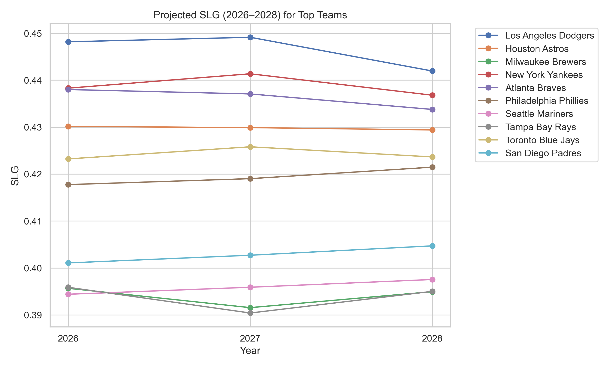
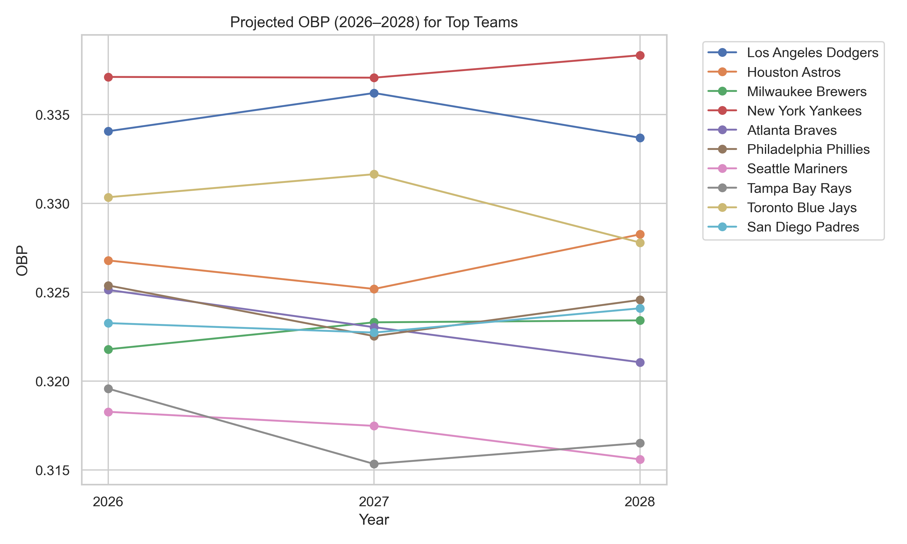
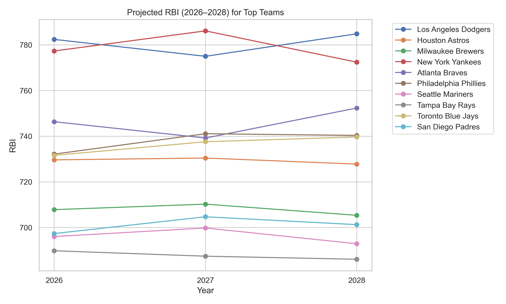
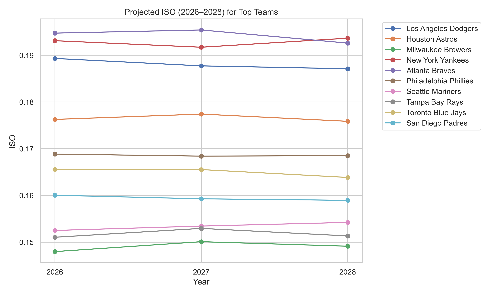
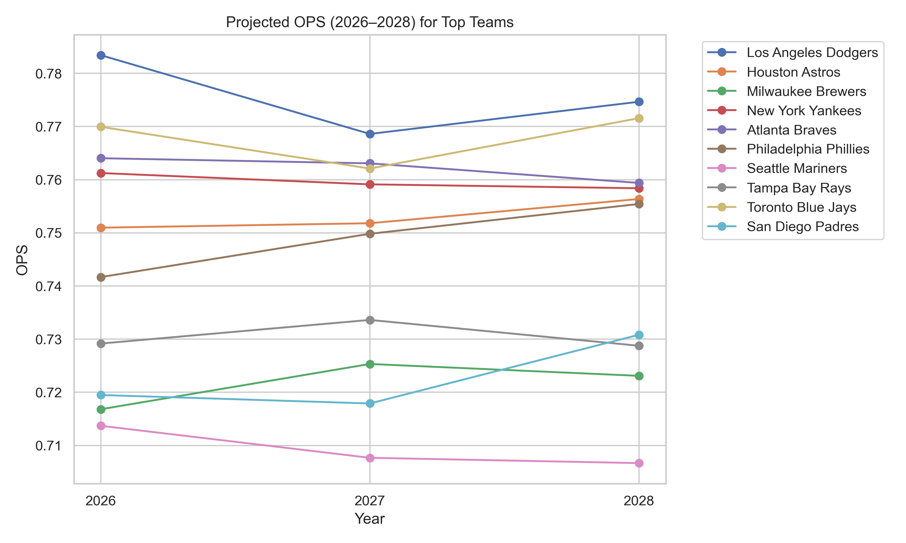
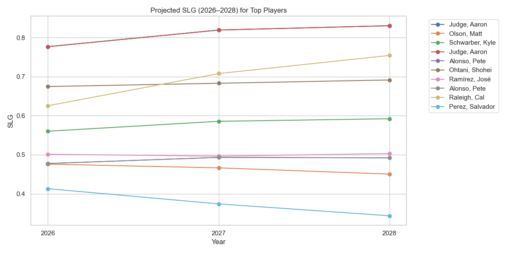
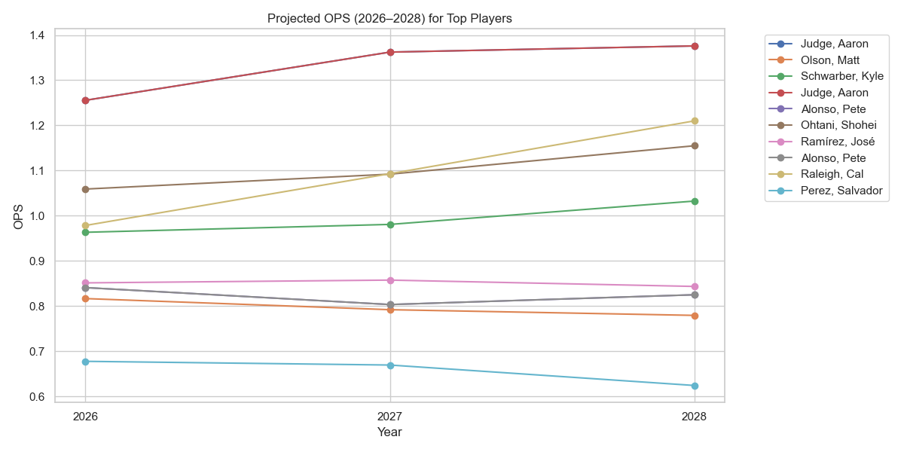
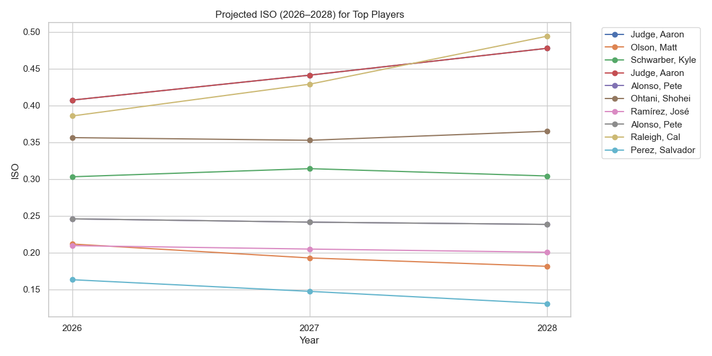
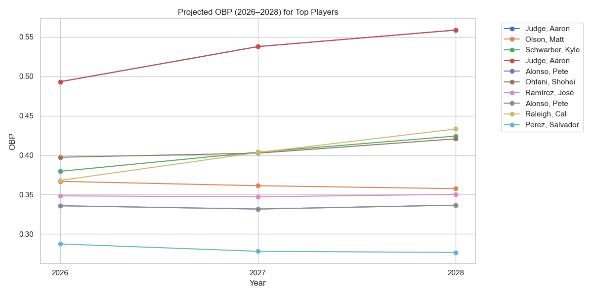
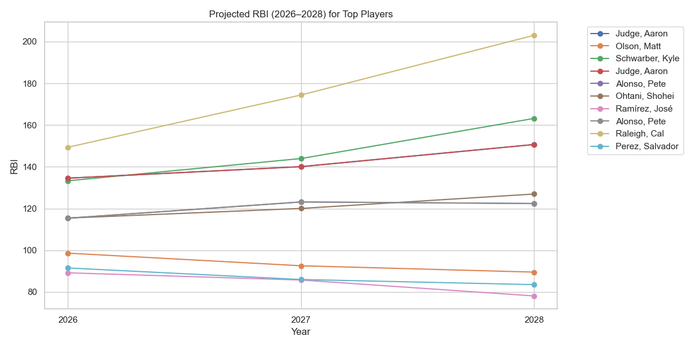

# Group #3 - Checkpoint 2

## 1. Introduction

Our team explores **MLB batting performance indicators** using data from Baseball Savant.  

**Decision-maker / Context:**

- Baseball analysts and coaches interested in understanding player performance and team-level KPIs.

**Research Question:**

- Which batting metrics are most predictive of overall offensive value, and how does player/team performance over time indicate future success?  

**Impact:**

- Insights could guide player evaluation, team decisions, and strategy planning.

---

## 2. Data Summary
Primary Datasets:

- MLB team stats 2021-2025.csv

- MLB player stats 2021-2025.csv

Columns / Metrics:

- Players: player info, plate appearances (PA), batting stats, KPIs (OBP, SLG, OPS, ISO, BABIP, RBI, xBA, xSLG, exit velocity, etc.)

- Teams: Win%, SLG, OBP, RBI, ISO, OPS

Data characteristics: Mixed continuous metrics, percentages, and categorical identifiers (player, year).

Summary statistics:

- Highlight top 10 performers in each dataset.
- Player/team projected performance.
- Most predictive metric of overall offensive value.

---

## 3. Data Analytics

### 3.1 Team Projections (2026–2028)

These plots show projected team-level KPIs for the next three seasons of top 10 teams based on linear regression with correlated predictors.  

**Top Teams Selected:** Based on 2025 Win%

**Graphs and Captions:**

**Projected Win Percentage (2026–2028)**  
  
*Description:* Projected win percentage for top MLB teams. Shows expected growth/decline in team performance over three years.

**Projected SLG (2026–2028)**  
  
*Description:* Shows projected slugging performance of top teams. Patterns indicate which teams may improve power hitting.

**Projected OBP (2026–2028)**  
  
*Description:* Team on-base percentage projection, reflecting plate discipline and consistency.

**Projected RBI (2026–2028)**  
  
*Description:* Estimated run production by team, linked to scoring potential.

**Projected ISO (2026–2028)**  
  
*Description:* Measures team isolated power; highlights teams likely to hit extra-base hits.

**Projected OPS (2026–2028)**  
  
*Description:* Combined on-base plus slugging metric, giving a broad measure of offensive efficiency.

---

### 3.2 Player Projections (2026–2028)

These plots show projected player-level KPIs for the top 10 players based on prior performance and correlated metrics.

**Graphs and Captions:**

**Projected SLG for Top Players**  
  
*Description:* Expected slugging trends for top players. Highlights consistency and potential breakout performers.

**Projected OPS for Top Players**  
  
*Description:* Combines OBP and SLG for a holistic view of player offensive output.

**Projected ISO for Top Players**  
  
*Description:* Player isolated power trends, indicating extra-base hitting capability.

**Projected Batting Average for Top Players**  
  
*Description:* Tracks expected hit rate per at-bat for top players.

**Projected OBP for Top Players**  
  
*Description:* Player on-base percentage projections, reflecting consistency and plate discipline.

**Projected RBI for Top Players**  
  
*Description:* Expected run production per player, linked to scoring potential.

**Projected Exit Velocity for Top Players**  
_2026_2028.png)  
*Description:* Exit velocity trend predictions; higher values often correlate with power hitting.

### 3.3 Scatter Plots & Heatmaps (Quick Reference)

These plots show relationships between exit velocity and player hitting stats, and overall correlations among KPIs.

**EV vs SLG:**  
  

**EV vs RBI:**  
  

**EV vs OPS:**  
  

**EV vs OBP:**  
  

**EV vs ISO:**  
  

**EV Correlation Heatmap vs Hitting Stats:**  
  

**Team Rankings Heatmap (2021–2025 averages):**  
%20averages.png)

## 4. Conclusion

Our analysis combined historical MLB player- and team-level statistics with regression-based projections to estimate future offensive performance for 2026–2028. By examining KPIs such as SLG, OBP, OPS, ISO, RBI, Batting Average, and Exit Velocity, we generated insights into which metrics are most indicative of future success.

**Key Findings:**

- OPS and ISO consistently emerge as the strongest indicators of future offensive performance at both the team and player levels. Teams and players maintaining strong OPS trends also show positive projections in Win%, RBI, and SLG.

- Exit Velocity has moderate correlation with power metrics (ISO ≈ 0.65, SLG ≈ 0.62), but does not strongly correlate with most KPIs.
→ This means EV is useful, but not a primary predictor in your dataset.

**Team Projections (2026–2028):**

- Projected Win%, SLG, OBP, ISO, and OPS show identifiable upward/downward trends, helping estimate which teams may strengthen or decline offensively.

**Player Projections (2026–2028):**

- Top hitters show differentiated paths in SLG, OPS, ISO, AVG, OBP, and Exit Velocity, helping identify consistent elite hitters versus potential breakout performers.

**Heatmaps and Scatter Plots:**

- Correlation heatmaps confirm how hitting metrics relate to each other, supporting the regression choices used in projections.
Scatter plots visually confirm the moderate relationships between EV and power statistics.

**Limitations:**

- The model only uses batting statistics; defensive and situational factors are not included.

- Projections are based on linear regression, which may not capture sudden changes (injuries, role changes, coaching changes, etc.).

**Future Work:**

- Add park effects, defensive WAR, sprint speed, pitch-level statcast features, injury history, and multivariate models.

- Use machine learning methods for improved forecasting accuracy.

## 5. Policy Recommendation

**Hypothetical Decision:**

- Prioritize player acquisitions, contracts, and lineup planning based on projected offensive output.

**Data-driven Recommendation:**

- Focus on players and teams with consistently high OPS, ISO, and OBP. Consider potential breakout performers in mid-tier metrics.

**Benefits:**

- Quantitative and objective evaluation of offensive potential.

**Risks:**

- Ignores defensive contributions and external factors; requires continuous monitoring of updated metrics.

---

## Current Steps for Checkpoint 2

1. Complete KPI calculations in Python and update tables.  
2. Generate initial visualizations and save them in `output/`.  
3. Update README.md with insights from analysis.  
4. Commit and push updates to `Group_3_Checkpoint_2.0` branch regularly.  
5. Ongoing amendment of the final report (README.md).

## Team Collaboration Notes

Challenges:

- Learning Git workflow and branch management
- Collaborating in code writing

Victories:

- Created a common repo
- Created project outline
- Assigned roles
- Learning GitHub Desktop workflow (branch management, pushing/pulling)
- Agreed on main indicators & KPIs to analyze

---

## Individual Contributions

| Member | Role | Contribution |
|---|---|---|
| Matthew G Gonzalez | Project Lead / Co Head Developer | Data cleansing + Writing codes + visualization + findings and write-up |
| Jacob D Lamothe | Code Editor/Checker + Video Editor + Presentation/Narration Lead | Checks code for mistakes/redundancies + statistical validation + Edits video at the end of project |
| Rodolfo Lazaro | Visualization Designer | Tableau plots + checking visualizations |
| Samir Soliman | Head Developer | Import data + write codes + statistical Validation/Model Evaluation + findings and write-up |

## The next section will be deleted from our final report.

## Progress on the 8 Major Tasks

1) We selected Option 1 — Baseball Savant MLB performance indicators.  

2) Repository created.Team are collaborating on GitHub (Commit → Pull → Push workflow is currently used)

3) Data downloaded from baseballsavant.mlb.com

4) Python & Tableau are currently used for analysis and visualizations: Scatter Plots for relationships between variables, Line Plots to show performance trends over years, Boxplots to visualize distributions of key metrics & Histograms for frequency distributions of variables.

5) The team is working on KPIs and forecast:
On-Base Percentage (OBP), Slugging Percentage (SLG), Isolated power, Batting avg. & Exit Velocity

6) This README.md is Checkpoint 2 deliverable.

7) The recorded video will show results with narration.

8) The final report will be displayed in the README.md file on the repo landing page.

---